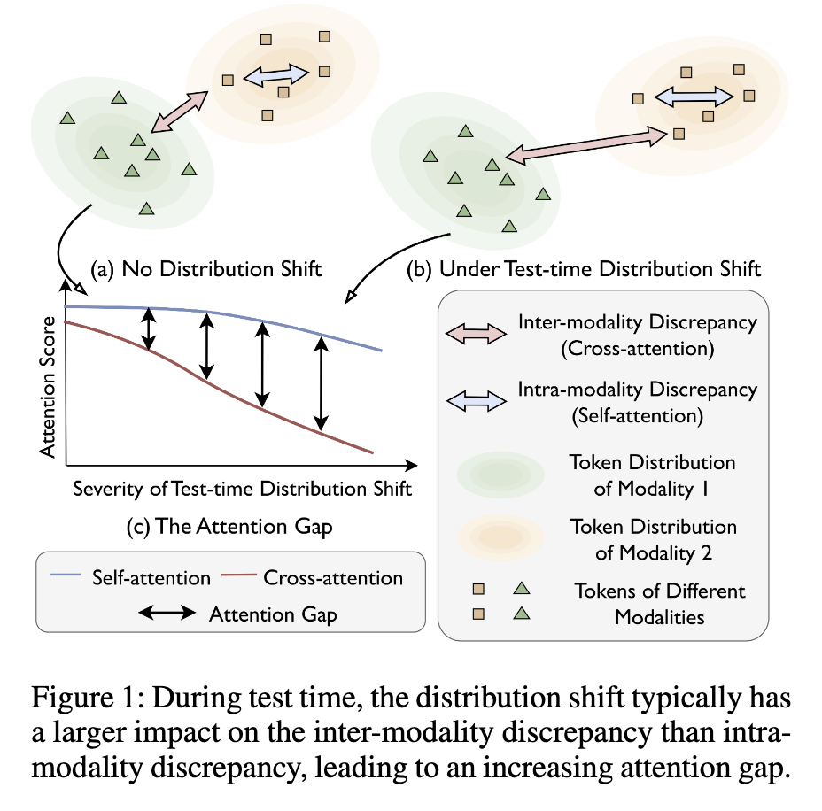
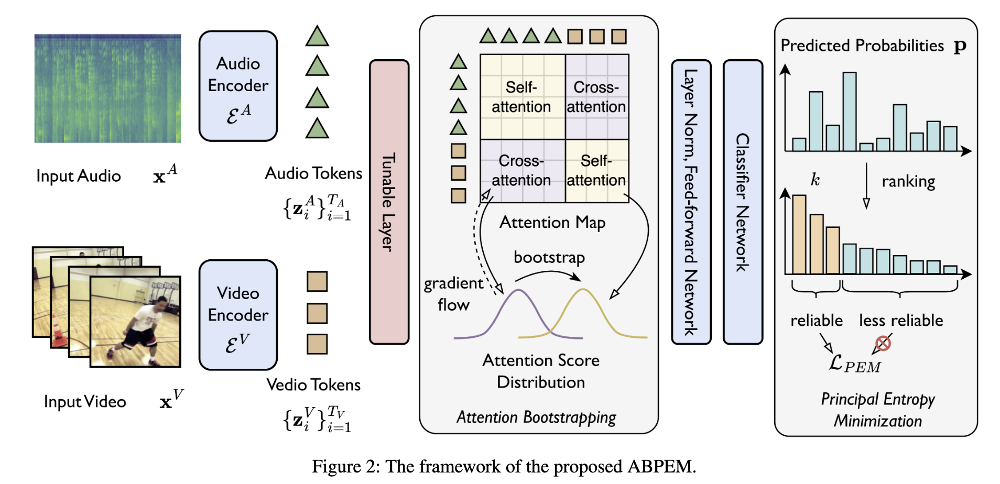

# Attention Bootstrapping for Multi-Modal Test-Time Adaptation

This is the PyTorch implementation for the paper "Attention Bootstrapping for Multi-Modal Test-Time Adaptation" (AAAI 2025).

## Paper

### Abstract

Test-time adaptation aims to adapt a well-trained model to potential distribution shifts at test time using only unlabeled test data, without access to the original training data. While previous efforts mainly focus on a single modality, test-time distribution shift in the multi-modal setting is more complex and calls for new solutions. This paper tackles the problem of multi-modal test-time adaptation by proposing a novel method named Attention Bootstrapping with Principal Entropy Minimization (ABPEM). We observe that testtime distribution shift causes misalignment across modalities, leading to a large gap between intra-modality discrepancies (measured by self-attention) and inter-modality discrepancies (measured by cross-attention). We name this the attention gap. This attention gap widens with more severe distribution shifts, hindering effective modality fusion. To mitigate this attention gap and encourage better modality fusion, we propose attention bootstrapping that promotes cross-attention with the guidance of self-attention. Moreover, to reduce the gradient noise in the commonly-used entropy minimization, we adopt principal entropy minimization, a refinement of entropy minimization that reduces gradient noise by focusing on the principal parts of entropy, excluding less reliable gradient information. Extensive experiments on the benchmarks validate the effectiveness of the proposed ABPEM in comparison with competing baselines.

### Figures

The attention gap:

The ABPEM framework:

## Code

### Main Requirements

torch==1.13.1
torchaudio==0.13.1
timm==0.6.5
scikit-learn==0.22.1
numpy==1.21.6

### Data preparation

Please download files provided by [Yang et al.](https://github.com/XLearning-SCU/2024-ICLR-READ). Available sources: [Google Cloud](https://drive.google.com/drive/folders/1SWkNwTqI08xbNJgz-YU2TwWHPn5Q4z5b?usp=sharing) or [Baidu Clound](https://pan.baidu.com/s/1Xo3IxQyd_fkzMVofDWKYVw?pwd=fnha).

### Running

#### Step 1: prepare data

Please refer to `scripts/data_process.sh` and `scripts/make_corruption.sh` for details.

#### Step 2: adaptation

Please refer to `scripts/ours-*.sh` for details.

## Acknowledgements

The code is based on [READ](https://github.com/XLearning-SCU/2024-ICLR-READ), [CAV-MAE](https://github.com/YuanGongND/cav-mae?tab=readme-ov-file#pretrained-models) and [Tent](https://github.com/DequanWang/tent).
